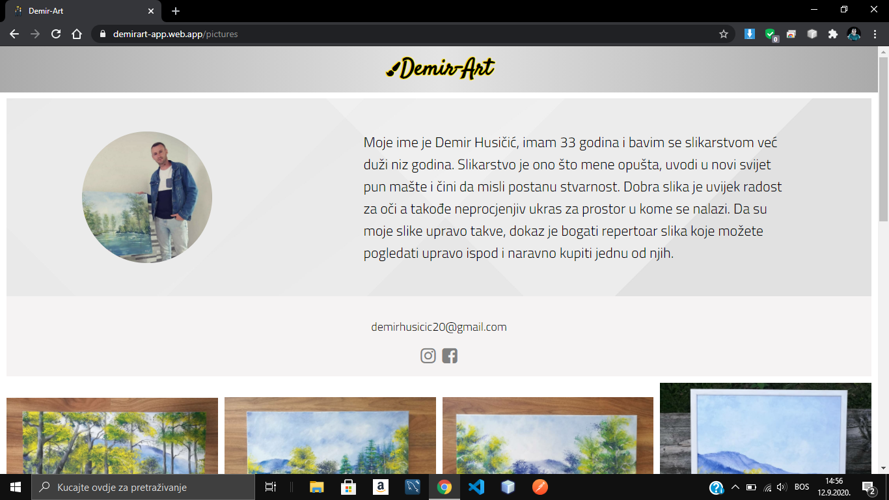
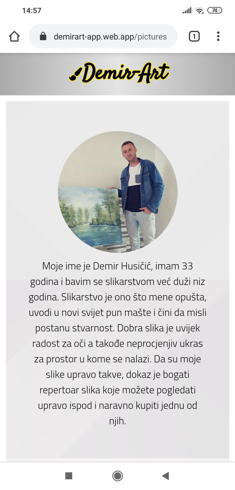
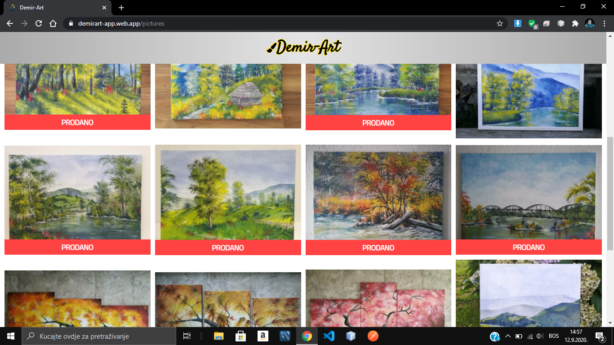
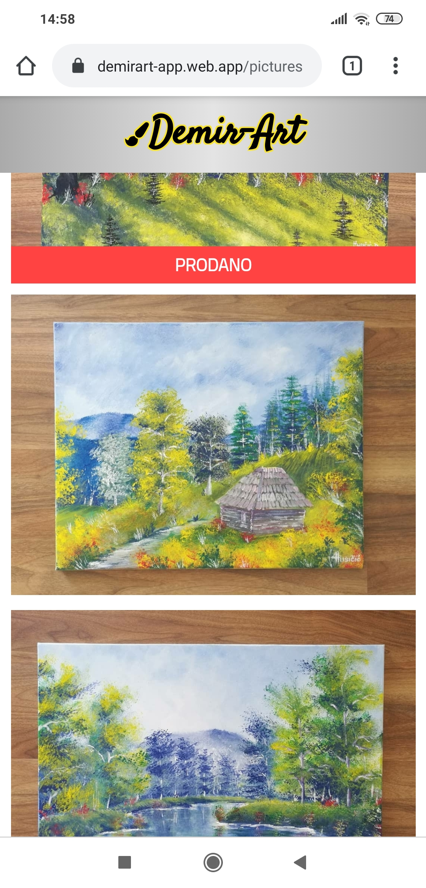
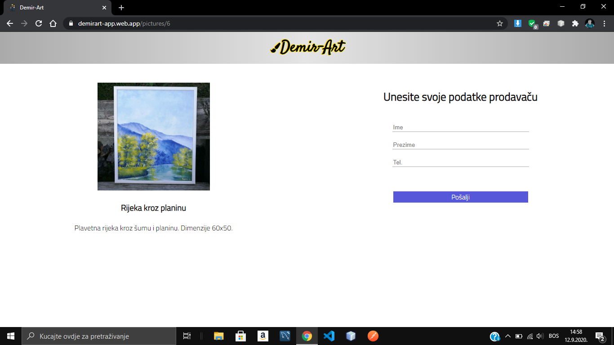
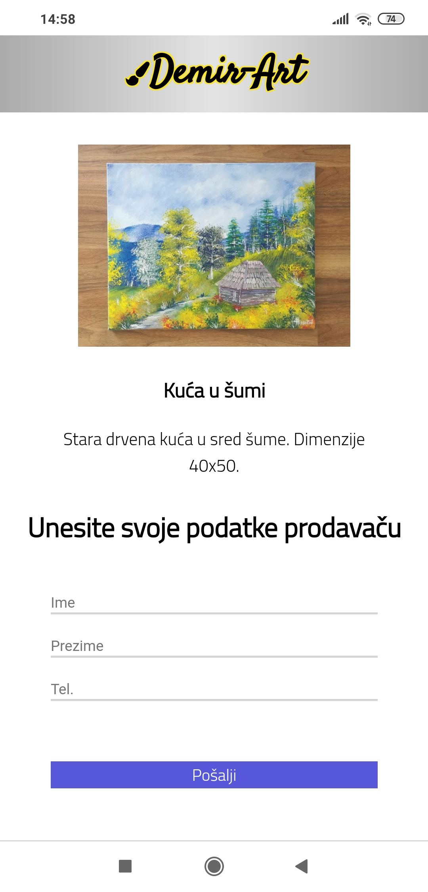

# Demir-Art-Spring-Boot

## This is the backend part of the Demir-art application. 
The application's backend is built using Spring Boot with Java. The backend itself is hosted on Heroku. 
Here is the link of the application itself - <a href="https://demirart-app.web.app" target="blank">Click here.</a> 
And here is the link to the frontend code. <a href="https://github.com/Imran-Sehic/Demir-Art-Angular" target="blank">Click here</a> 
And if you are from Bosnia and Herzegovina you can even buy an artwork. The seller is shipping countrywide! 😁  
Below are some of the screenshots of the application itself.  

&nbsp;&nbsp;&nbsp;&nbsp;&nbsp;&nbsp;
  

&nbsp;&nbsp;&nbsp;&nbsp;&nbsp;&nbsp;
  

&nbsp;&nbsp;&nbsp;&nbsp;&nbsp;&nbsp;

